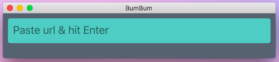

# BumBum
Pretty &amp; simple video downloader




## Create packages

Freeze app:

```sh
# activate virtualenv
source ~/.virtualenvs/bumbum/bin/activate
# set path to QT if pyinstaller ask for it
export QT5DIR=/usr/local/Cellar/qt/5.8.0_2/
# run pyinstaller
pyinstaller bumbum/bumbum.py --add-data 'bumbum/gui:gui' -w -y
```

### MacOS
```sh
# git clone https://github.com/andreyvit/create-dmg
./create-dmg --window-size 640 480 --app-drop-link 0 0 BumBum.dmg ../BumBum/dist/
```